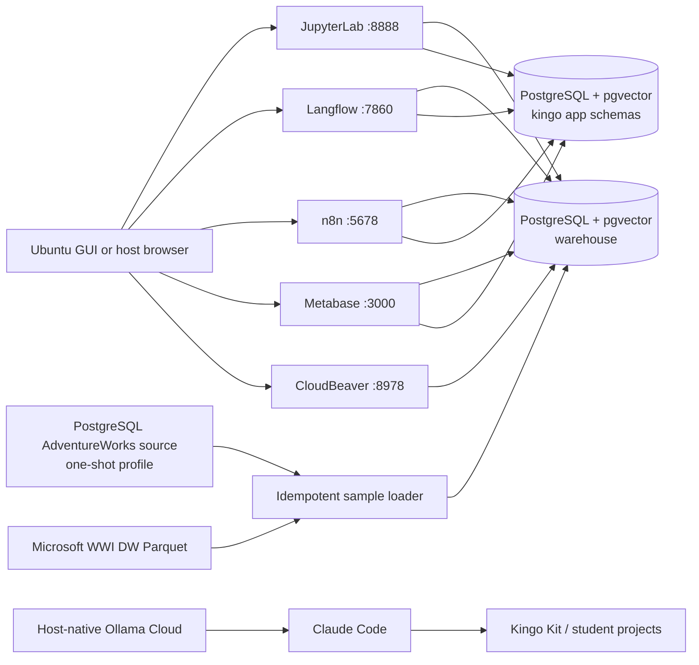

# Architecture

Each application is defined in its own `apps/APP/compose.yaml`; the root `compose.yaml` includes them for whole-stack operation. All long-running services share the private, externally named `kingo-kit` Docker network, which lets independently managed Compose projects resolve PostgreSQL as `postgres`. Persistent volumes have fixed Kingo Kit names so switching between aggregate and per-app commands does not create fresh application state. Only explicitly mapped ports are reachable from the Ubuntu host. The default bind address is loopback.

The AdventureWorks source container is only started by the `samples` Compose profile. Its PostgreSQL-native contents are streamed with `pg_dump`/`psql` into the main pgvector warehouse, after which the source container is stopped. WWI Parquet files are discovered from the public Azure Blob listing and copied in Arrow batches. Dataset completion markers live in `warehouse.kingo_meta.sample_loads`.
